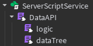

# Hierarchie


# Documentation:
## Data Tree
```lua
local API = {
	["DataStoreName"] = "dataAPI",
	["Folders"] = {
		[1] = {
			["Name"] = "leaderstats",
			["Values"] = {
				[1] = {
					["Instance"] = "NumberValue",
					["StartValue"] = 0,
					["Save"] = true,
					["Name"] = "temp"
				},
			}
		}
	}
}
```

```lua
dataTree.DataStoreName -- is the name under which the datastore saves  
dataTree.Folders[i] --is the location to create your folders  
dataTree.Folders[i].Name --is the folders name  
dataTree.Folders[i].Values --is the folders values  

dataTree.Folders[i].Values[i] --is the location to create your values  
dataTree.Folders[i].Values[i].Instance --is the value type  
dataTree.Folders[i].Values[i].StartValue -- is the value with which it starts  
dataTree.Folders[i].Values[i].Save  --decides if the value saves  
dataTree.Folders[i].Values[i].Name --is the name of the value  
```

## Logic
Inside of [DataAPI.lua](./scripts/DataAPI.lua)

## Example
```lua
local DataAPI = require(script.Parent.DataAPI)

game.Players.PlayerAdded:Connect(function(player)
	DataAPI.load(player)
end)

game.Players.PlayerRemoving:Connect(function(player)
	DataAPI.save(player)
end)

DataAPI.autoSave(60)
```

# Software:
[Scripts](./scripts)  
[Roblox Model](https://create.roblox.com/store/asset/115458272351878/DataAPI)