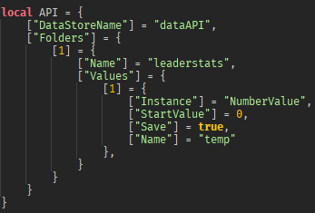

# Hierarchie

# Documentation:
## Data Tree

dataTree.Folders[i] | is the location to create your folders  
dataTree.Folders[i].Name | is the folders name  
dataTree.Folders[i].Values | is the folders values  

dataTree.Folders[i].Values[i].Instance | is the location to create your values  
dataTree.Folders[i].Values[i].StartValue | is the value type  
dataTree.Folders[i].Values[i].Save  | decides if the value saves  
dataTree.Folders[i].Values[i].Name | is the name of the value  

Inside of [DataAPI.lua](./scripts/DataAPI.lua)

# Software:
[Click Here](./scripts)